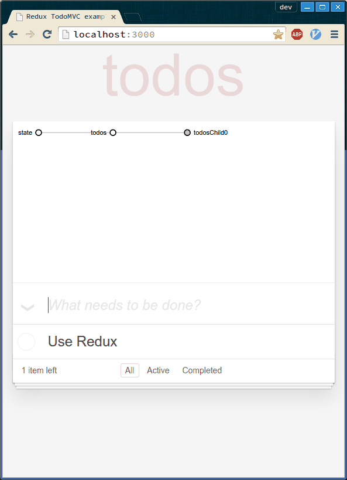

# redux-store-visualizer

Visualize Redux store in real time with [d3-state-visualizer](https://github.com/romseguy/d3-state-visualizer)

# Quick demo



# Features

- Fully configurable.
- Hot reloadable since it's only a component that receive any state as props.
- React not required.

# Try it out yourself!

```
git clone https://github.com/romseguy/redux-store-visualizer.git
cd redux-store-visualizer
npm install
npm start
# http://localhost:3000
```
